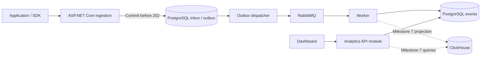

# Analytics and Event Tracking Platform: project plan

Status, September 18, 2026: milestones 1–2 and milestone 4's local MVP feature scope are implemented. M5-01 adds project administration and audited account recovery; M5-02 adds production configuration, restricted database grants, TLS verification, encrypted cookie keys, shared login limits and a migration command. Both are verified locally; [milestone 5's task ledger](MILESTONE_5.md) tracks the remaining release work. At the user's request, milestone 4 was prioritized after M3-01 worker extraction; RabbitMQ, retries/dead letters and outbox monitoring in milestone 3 remain unfinished. The hosting spike records successful Hosted health checks; milestone 5 has not been deployed publicly. See [milestone 3 remaining tasks](MILESTONE_3.md), [milestone 4 setup and evidence](MILESTONE_4.md), [hosting spike results](HOSTING_SPIKE.md), and the [current API contract](API_V1.md).

Build a platform where developers send application events and product teams explore usage, conversion, and retention. Each milestone should produce a runnable demo and evidence that its behavior is correct.

## Working assumptions and scope

- Confirmed goal: a portfolio project that teaches distributed backend design and must reach production.
- Confirmed planning baseline: one developer working part-time; use deliverable-based milestones rather than calendar deadlines.
- Hosting preference: free deployment if feasible, including Vercel. Target a small personal live release within free quotas; verify the API hosting path early and retain the production-readiness goal.
- Keep ASP.NET Core and the repository's .NET 10 target. Start with PostgreSQL, introduce RabbitMQ after durable ingestion, and evaluate ClickHouse against measured workloads.
- Confirmed first integration: build a small fake shop with both browser activity and server-confirmed mock orders; no real payment or personal details. Keep its initial demo local while production authentication, limits, and a client credential model are developed.
- Support project isolation early. Full organization management, billing, and enterprise features can follow later.
- MVP feature boundary: milestones 1-4. The first production release requires milestone 5. Advanced analytics and ClickHouse follow in milestones 6-7.
- Exclude session replay, heatmaps, advertising attribution, arbitrary SQL, machine learning, Kubernetes, and multi-region deployment from the initial scope.

## Existing foundation: milestone 0

The code already includes:

- `POST /events` with required event-type validation and a server-generated event ID.
- An unbounded in-memory channel and a hosted background worker inside the API process.
- An in-memory event store.
- Event counts through `GET /analytics/events` and per-user counts through `GET /analytics/users/{userId}`, with optional date filters.
- Three integration tests covering ingestion/counts, user filtering, and missing event types.

An early shop demo is now implemented at `/shop/index.html`: three products, a quantity-controlled cart, cancelable checkout, mock order receipts, and a session event feed showing browser/server sources. Browser events are `page_view`, `product_added`, and `checkout_started`; the shop backend emits `purchase_completed` after validating its catalog prices and quantities. Same-ID order retries are idempotent within the running process. Four additional integration tests cover this flow, retries, validation/session separation, and the development-only default. Existing asynchronous test polling now waits for expected counts.

This is a partial demonstration of the milestone 4 experience. The shop backend currently shares the API process, and browser telemetry is best effort; it does not implement the future authenticated SDK, persistence, or hosted production profile.

Current limitations: process restarts lose queued and stored events; general ingestion/analytics requests have no authentication or project scope; general ingestion retries create new IDs and can double-count; queue memory has no bound. The general ingestion response also advertises an event URL that has no matching read endpoint. Demo order deduplication and visit cookies do not replace production persistence or authorization.

## Feature list

| Area | MVP features | Later features | Milestones |
| --- | --- | --- | --- |
| Ingestion | Versioned single and batch endpoints, event IDs, timestamps, custom properties, validation, documented errors | Browser SDK, event schema registry | 1-2, 4, 6 |
| Access | Projects, separate ingestion and analytics permissions, hashed and revocable keys, scoped queries | Dashboard login, organization roles, key rotation UI | 1, 4-5 |
| Storage | PostgreSQL persistence, migrations, unique event identity, indexes, retention baseline | Partitioning if justified; ClickHouse analytical storage | 2, 7 |
| Processing | Durable acceptance, retry-safe processing, separate worker, RabbitMQ, bounded retries, dead-letter inspection and replay | Historical backfill, operational replay tools | 2-3, 5, 7 |
| Analytics | Counts, time series, event/property filters, active users, user event timeline | Funnels, retention cohorts, sessions, revenue by currency | 2, 4, 6 |
| Dashboard | Project selector, date filters, charts, event explorer, ingestion status, useful empty/error states | Saved views, funnel and retention views | 4, 6 |
| Developer experience | OpenAPI examples, demo producer, Docker Compose, local setup, CI | JavaScript client batching/retries, deployment guide | 1-5 |
| Operations | Structured logs, health checks, queue/processing metrics, payload and rate limits | Tracing, alerting, load reports, backup/restore and incident runbooks | 1-3, 5 |
| Data controls | Property restrictions, payload limits, configurable retention, synthetic fixtures | Subject deletion/export across stores and replay paths, audit trail | 1-2, 5, 7 |

## Architecture and evolution

Start with one API application divided into ingestion, analytics, and project-access modules. The first milestone 3 slice extracts the database worker and shared persistence library before introducing RabbitMQ. Separate ingestion and analytics deployments only if load or operational needs justify it.

The distributed profile in milestone 2 makes PostgreSQL the durable acceptance boundary: the API commits a validated event to an inbox before returning `202`. A database worker projects inbox records into queryable events. Milestone 3 uses those same committed records as an outbox for publishing to RabbitMQ, so there is no database-and-broker dual write in the HTTP request. The free hosted profile below instead commits queryable events during the request, so it does not depend on a continuously running worker.



Project metadata and credentials remain in PostgreSQL. In milestone 7, PostgreSQL events remain the canonical replay source within the retention window while ClickHouse is a rebuildable query projection. A sustained move away from PostgreSQL as the event source requires its own storage and recovery decision.

Proposed technology choices:

| Component | Initial choice | Reason / decision gate |
| --- | --- | --- |
| API and worker | ASP.NET Core, EF Core with PostgreSQL provider | Extend the current code and keep transactional persistence straightforward |
| Queue | RabbitMQ in milestone 3 | Learn explicit publishing confirmation, consumer acknowledgement, retry, and recovery behavior |
| Analytical database | PostgreSQL first; ClickHouse in milestone 7 | Compare correctness, query latency, and operational cost on the same dataset |
| Dashboard | React with TypeScript and Vite | Implemented in milestone 4, served by the API with cookie sessions |
| Local environment | Docker Compose | Repeatable API, worker, database, and broker setup |
| Observability | Structured logs, OpenTelemetry; Prometheus/Grafana when needed | Trace acceptance through processing and measure backlog and latency |
| Deployment | Vercel dashboard and candidate API container; Neon PostgreSQL | Validate the container beta in an early spike; Render is a fallback for a public hobby demo |

RabbitMQ confirms and consumer acknowledgements cover different stages; a lost confirmation or connection can cause redelivery. Plan for at-least-once delivery and idempotent effects. See the [RabbitMQ reliability guide](https://www.rabbitmq.com/docs/reliability) and [acknowledgement documentation](https://www.rabbitmq.com/docs/confirms).

## Free deployment strategy

Provider information checked September 13, 2026. Vercel/Neon Hosted health checks are now recorded in the hosting spike; the remaining provider limits and release criteria are still a proposal awaiting verification.

| Component | Proposed free host | Relevant constraint |
| --- | --- | --- |
| Dashboard | Vercel Hobby | Personal, non-commercial use and usage quotas |
| ASP.NET Core API | Evaluate Vercel Container Images | OCI HTTP containers are documented in beta on all plans; validate .NET 10 build, startup, database access, and limits |
| PostgreSQL | Neon Free | Currently 0.5 GB storage and 100 CU-hours per project per month; fit data and indexes within the allowance |
| RabbitMQ and separate worker | Local Docker Compose initially | Retain distributed learning and recovery tests without requiring an always-on hosted broker/consumer |
| ClickHouse | Local milestone 7 evaluation initially | Hosted adoption needs a separate capacity and budget decision |

Vercel's container documentation supports evaluating the API there; the hosting spike separately records successful application health checks. Containers scale down after idle periods, so a background worker cannot be the sole mechanism that completes accepted events. Sources: [Vercel Container Images](https://vercel.com/docs/functions/container-images), [Vercel Hobby](https://vercel.com/docs/plans/hobby), and [Neon Free plan](https://neon.com/blog/how-to-make-the-most-of-neons-free-plan).

If the Vercel spike fails, evaluate Render's Docker web service for the personal demo. Render Free sleeps after 15 minutes without incoming traffic and may take about a minute to wake. Its free PostgreSQL expires after 30 days, so use Neon for persistent data. Render explicitly recommends its free instances for hobby/testing use rather than production applications; it is not the fallback for a customer-facing availability commitment. Sources: [Render Docker](https://render.com/docs/docker) and [Render Free](https://render.com/docs/free).

Use two explicit application profiles with shared validation, project authorization, event identity, and analytics semantics:

- **Free hosted profile:** `client -> ASP.NET Core -> PostgreSQL -> analytics queries`. Commit the queryable event and any necessary identity record in the request transaction; return `200` with a persisted status after commit. Do not acknowledge volatile work or launch essential processing after returning. Deduplicate concurrent retries in the database. No pending inbox/outbox is created in this profile.
- **Distributed profile:** use the inbox/outbox, RabbitMQ, and separate worker architecture above; return `202` with an accepted status after durable inbox commit. Run this locally first, then host it when continuously available compute and broker storage are settled.

Document both success responses in OpenAPI and require clients to handle either. Select the profile by deployment configuration; never switch automatically on a database/broker failure. Keep mode transitions explicit and test event-count parity. The free profile optimizes for small workloads; it does not claim the distributed pipeline's scaling characteristics.

Keep free hosting viable with bounded batches, short configurable retention, a storage quota below the provider limit, and no continuous empty-queue database polling. Before release, choose and test a supported schedule for retention and backups; request-time storage limits must still reject new writes safely if cleanup is delayed. Use provider subdomains initially and run large benchmark datasets locally. Do not promise that a 1-million-event fixture fits a 0.5 GB hosted database.

Milestone 5 remains the public-release gate for access controls, persistence, backup/restore, and operating limits. A free personal release may have cold starts and quota-related unavailability. Revisit hosting before commercial use, or when availability, storage, throughput, or background processing needs exceed the free plan. Vercel Hobby is restricted to non-commercial personal use; customer production is a later deployment decision, not an assumed free entitlement.

## What server-side and browser tracking mean

This choice concerns the application being measured, not where the analytics dashboard is hosted. Both sources ultimately send events to this platform's ingestion API.

| Source | Example path | Best initial events | Main implications |
| --- | --- | --- | --- |
| Server-side | Shop backend confirms payment, then sends an event to the tracking API | `signup_completed`, `login_succeeded`, `purchase_completed` | Keep the ingestion credential on the server; emit only after the business action succeeds; persist producer retries when loss matters |
| Browser | JavaScript in the shop page sends an event to the tracking API | `page_view`, `button_clicked`, `checkout_started` | Can observe UI activity; delivery is best effort; credentials embedded in JavaScript are public; add public-source quotas and validation |

A browser can report a purchase-button click even when payment fails. The shop backend can report a completed purchase after its payment/business state is confirmed. Keep these as distinct event types. Server-originated events are only as reliable as their integration: preserve a stable event ID across retries, and eventually add a transactional outbox to the tracked application for important business events. Do not make a customer's checkout depend on a sleeping analytics service responding immediately.

The eventual recommendation is hybrid: browser events describe behavior and server events describe confirmed outcomes. For example, `page_view -> checkout_started -> purchase_completed`. Plan the identity passed by both sources before correlating them; never treat a user ID supplied by public browser code as authenticated proof. Avoid counting both sources as the same purchase.

Confirmed starting scope: a small fake shop built in this repository, with both event sources and no payment integration. Its local demo covers the full `page_view -> checkout_started -> purchase_completed` path. Add public collection controls and authenticated project access before exposing it publicly; retain the source distinction when building the production SDK.

## Event contract and semantics

Proposed versioned payload; this is not the current API contract:

```json
{
  "eventId": "876c1377-3b61-4ebf-966b-c53eb3b22753",
  "eventType": "purchase",
  "schemaVersion": 1,
  "userId": "user-123",
  "anonymousId": null,
  "sessionId": "session-456",
  "occurredAt": "2026-09-13T08:30:00Z",
  "properties": {
    "orderId": "order-789",
    "amountMinor": 4999,
    "currency": "USD",
    "source": "checkout"
  }
}
```

- Derive project identity from authenticated credentials, never trust a project ID in the payload. Store server-controlled `receivedAt` separately from client event time.
- Require callers to reuse `eventId` on retries. Enforce uniqueness on `(projectId, eventId)` from milestone 2. Reusing an ID with a different normalized payload returns a conflict. Deduplication lasts for a documented window; reject event times outside the allowed window to keep replay and retention behavior bounded.
- Preserve `eventType` naming from the existing API. Add `/v1/events` and `/v1/events/batch`; document any transition for the existing endpoints. Omit the current nonexistent status URL until a status endpoint exists.
- Starting limits to validate: 32 KiB per event, 100 events and 1 MiB per batch, bounded property depth/count, event names up to 100 characters, and a configurable project rate limit. Return `413` for size violations and `429` for rate limiting.
- Initially validate an entire batch before accepting it and commit it atomically. Return validation locations for invalid entries; successful retries report already-accepted IDs without adding counts. Avoid partial acceptance until there is a demonstrated need.
- In the distributed profile, `202 Accepted` means durably queued from milestone 2 onward, not already visible in analytics. In the free hosted profile, return `200` only after the queryable event commits. Return a retryable service error if persistence is unavailable. Document analytics freshness separately from request latency.
- Use UTC storage and half-open query windows `[from, to)`; explicitly document this change from the prototype's inclusive end time. Define time bucket timezone and daylight-saving behavior before adding local calendar reports.
- Initial proposal: accept event times up to seven days late and five minutes ahead, with configurable limits. Handle out-of-order events without assuming queue delivery order equals event order.
- Count unique users using documented identity rules. Start with explicit `userId` and separate anonymous reporting; defer merging anonymous and authenticated histories until milestone 6.
- Treat purchase totals as analytics; store integer minor amounts and currency, never add different currencies together. Define whether business order IDs deduplicate purchase reporting separately from transport event IDs.
- Allow only bounded, validated property filters and dimensions. Never concatenate user-provided property names into SQL. Avoid collecting passwords, tokens, full URLs with sensitive query strings, or unrestricted request bodies.

## Milestones

### Milestone 1 — Establish contracts and project access

**Outcome:** a well-defined API that separates data by project and rejects invalid requests consistently.

- Document the v1 payload, error format, event identity, date semantics, and acceptance guarantee; implement single-event validation and project-scoped API access.
- Add development project/key provisioning and separate ingest/read permissions. Move persistence of these records into milestone 2; do not embed production credentials in source.
- Bound the prototype queue and return explicit overload errors. Add request limits, basic rate limiting, structured logs, and liveness checks.
- Make the existing integration tests wait for the expected counts. Add targeted contract and cross-project authorization cases.
- Set up build/test CI and a deterministic demo producer.

**Done when:** one project cannot ingest as, or query, another; invalid and oversized events produce documented responses; queue overload does not grow memory without bound; CI passes. Clearly label the service as volatile until milestone 2.

**Demo:** send valid and invalid events for two projects and show isolated results.

### Milestone 2 — Deliver durable ingestion and PostgreSQL analytics

**Status:** implemented and verified locally, September 15, 2026. [Task ledger, setup and recovery evidence](MILESTONE_2.md). Both PostgreSQL profiles and container images are tested. The [hosting spike](HOSTING_SPIKE.md) subsequently recorded deployed Vercel/Neon health checks on September 16; hosted TLS, cold-start and quota verification remain pending.

**Depends on:** milestone 1.

- Add PostgreSQL, migrations, persisted projects/hashed credentials, durable inbox records, and an events table with JSON properties and initial query indexes.
- Commit the inbox before returning `202`; build a database-backed worker with transactional claiming or recoverable leases and idempotent projection into events.
- Persist the output event and mark inbox processing complete atomically; enforce unique IDs and conflicting-payload behavior.
- Implement batch acceptance, event/property filters, hourly/daily counts, active-user counts, and a cursor-paginated user timeline with stable ordering.
- Add configurable retention for processed data and identity records, preserving pending work. Document the retry window and bound both source and processed storage growth.
- Add Docker Compose and integration checks using real PostgreSQL.
- Add the free hosted request-transaction profile and verify identical validation, isolation, and deduplication semantics. Run an early Vercel container deployment spike covering .NET startup, TLS database connectivity, cold starts, concurrent duplicate requests, persistence after scale-down, and quota visibility; keep the chosen host provisional until this passes.

**Done when:** accepted events survive API/worker restart; a worker crash cannot lose a claimed event; duplicate requests count once; failed database commits never return success; migrations work from an empty database; analytics match a seeded fixture.

**Demo:** submit events, interrupt processing, restart, and show the complete deduplicated result.

### Milestone 3 — Introduce reliable distributed processing

**Status:** in progress. M3-01 extracts the PostgreSQL worker into an independent executable and shares persistence with the API. Process crash, restart and competing-worker behavior are tested; RabbitMQ and its recovery guarantees remain pending. See the [task ledger, setup and evidence](MILESTONE_3.md).

**Depends on:** milestone 2.

**Hosting scope:** complete this milestone in local Compose first. The free hosted release continues using the request-transaction profile; deploying the broker and worker is a later hosting decision.

- Extract `EventTracking.Worker` into a separate executable and introduce RabbitMQ with durable topology and persistent messages. Document that a single local broker has no node-loss high availability.
- Use committed inbox records as the publish outbox; mark publication complete only after broker confirmation and handle unroutable messages. Keep publication and processing status separate.
- Acknowledge consumption only after the PostgreSQL event transaction commits. Redelivery must be harmless if the worker crashes after commit but before acknowledgement.
- Add bounded exponential-backoff retries, transient/permanent failure classification, dead-letter storage, and an authenticated replay command that preserves event IDs.
- Define safe concurrency, prefetch, shutdown, message versioning, and payload compatibility. Monitor oldest pending event age, outbox size, queue depth, retry counts, and processing failures.
- Define an outbox quota so a prolonged broker outage produces controlled backpressure before disk exhaustion.

**Done when:** broker downtime leaves accepted events recoverable in PostgreSQL; a crash after publish but before marking publication can cause redelivery without duplicate counts; poison events stop retrying and remain inspectable; adding a second worker preserves results.

**Demo:** stop the broker and a worker at different processing stages, then recover and reconcile all accepted event IDs.

### Milestone 4 — Ship the usable MVP

**Status:** local MVP features implemented and verified. [Task ledger, setup, contracts and evidence](MILESTONE_4.md). Dashboard login/memberships, analytics, explorer/timeline, tracking client, demo and browser smoke are implemented. No production-readiness or RabbitMQ completion claim is made.

**Dependency adjustment:** the user requested milestone 4 after M3-01. Implemented against the stable milestone 2 query semantics and both current PostgreSQL profiles; finish M3-02–04 before claiming the planned reliable distributed MVP. Milestone 5 remains the public production-release gate.

- Add dashboard login and project authorization, event totals, time-series charts, active users, event/property filters, event explorer, and user timeline.
- Show the last query refresh time and measured processing lag. Include loading, empty, permission, and failure states.
- Add a small JavaScript tracking client with stable IDs, batching, bounded retries with jitter, and a demo application covering `page_view`, `login`, and `purchase`.
- Keep privileged read/server keys out of browser code. If direct browser ingestion is selected, use a distinct public write-only source identifier, source quotas, and abuse controls; origin checks alone are not authentication. Otherwise send through the demo application's backend.
- Add a setup guide, sample events, and an end-to-end smoke test from demo action to dashboard result.

**Done when:** a new developer can run the stack using the documented setup, create/select a project, generate events, and see correct charts; SDK retry does not increase counts; dashboard reads enforce project membership.

**Demo:** browse the sample application, log in, make a sample purchase, and inspect the resulting event timeline and charts.

### Milestone 5 — Make the platform operable as a hosted service

**Depends on:** milestone 4. This is the required first-production-release gate; complete controls for every store actually deployed.

**Status:** M5-01 administration and M5-02 production configuration/secrets are implemented locally. See [task ledger](MILESTONE_5.md) and [security/migration guide](PRODUCTION_SECURITY.md). M5-03 telemetry and alerts is next; no production-readiness claim is made.

- Add production configuration, secret handling, TLS, least-privilege service credentials, credential rotation, user roles, and audit records for administrative actions.
- Export metrics/traces and add alerts for processing lag, dead letters, disk growth, and elevated rejection/error rates.
- Document deployment, rollback, migrations, backup schedules, and restore procedures; execute a restore drill and verify restored analytics.
- Implement retention and subject deletion/export across source events, projections, queued work, and retry paths. Prevent old replay jobs from recreating erased data and document backup expiration behavior.
- Run load, soak, and failure tests; document hardware, payload distribution, rate limits, storage growth, recovery limits, and operating cost.
- Validate free-plan quota behavior, cold-start retries, storage cleanup scheduling, and externally recoverable backups. Publish the deployment profile and its availability limits; do not use local throughput targets as promises for the free host.
- Publish architecture decisions, benchmark results, an incident walkthrough, and a concise demo guide for the portfolio.

**Done when:** a fresh deployment and restore are reproducible; alerts trigger in injected failures; unauthorized cross-project access fails; deletion survives replay; the published operating limits match measured results.

**Demo:** deploy, trigger a worker failure, observe the alert and recovery, then restore data into a fresh environment.

### Milestone 6 — Add product analytics with explicit definitions

**Depends on:** milestone 5 for the planned release sequence; analytical prototyping only needs milestone 4.

- Implement ordered funnels such as `page_view -> login -> purchase`, with a defined conversion window and unique-user denominator.
- Add daily/weekly retention cohorts, specifying cohort entry, return events, timezone, and whether retention is exact-day or on/after. Start with exact-day retention.
- Add session summaries using explicit session IDs first; make any inactivity-based sessionization an explicit later choice.
- Add purchase totals by currency and clarify duplicate orders, refunds, and excluded events.
- Add saved query views and versioned event schemas. Decide anonymous-to-user linking before using merged identities in reports.

**Done when:** hand-calculated fixtures match funnels and retention, including repeated events, missing identity, late arrivals, timestamp ties, and timezone boundaries; incomplete cohort periods are visibly marked; schema changes do not silently break old events.

**Demo:** use a small known dataset to explain exactly why each report has its displayed values.

**Status:** implemented locally as durable dashboard APIs; see [Milestone 6 contract](MILESTONE_6.md). Fixture-level hand-calculation verification remains the release gate.

### Milestone 7 — Evaluate and add ClickHouse

**Depends on:** stable analytics contracts and representative data from milestones 4 and 6, plus the production controls in milestone 5.

- Benchmark PostgreSQL first using a reproducible dataset and recorded hardware. Add ClickHouse as a learning milestone, or prioritize it when PostgreSQL misses agreed query/ingestion targets after ordinary tuning.
- Design event ordering/partition keys and a durable PostgreSQL-to-ClickHouse projection work record. Commit canonical PostgreSQL events and projection work atomically; keep the ClickHouse checkpoint retryable.
- Backfill a fixed range and overlap it safely with live projection. Compare both databases by project, event type, and time bucket before switching reads behind a feature flag.
- Prove counts remain correct when the same event is inserted repeatedly. `ReplacingMergeTree` deduplication happens during background merges, so use verified query-time deduplication where necessary; do not assume an ordinary count is immediately correct. See the [ClickHouse documentation](https://clickhouse.com/docs/concepts/features/operations/update/replacing-merge-tree).
- Introduce pre-aggregations only after their replay/duplicate behavior is verified; a downstream aggregate must not count every delivery of the same event.
- Coordinate retention, deletion, replay, and projection lag across stores. Preserve a tested rollback to PostgreSQL reads; defer deleting the canonical source beyond the agreed retention window.

**Done when:** PostgreSQL and ClickHouse agree on deterministic fixtures and replayed batches; live/backfill overlap adds no counts; the benchmark records throughput, latency, storage, and correctness; query switching and rollback both work.

**Demo:** compare the same analytical queries at increasing dataset sizes and explain the measured tradeoffs.

## Measurement and completion rules

These are proposed test targets, not claims about current performance. Confirm them after the first PostgreSQL baseline:

| Measure | Initial proposed target |
| --- | --- |
| Ingest workload | 100 events/second for 15 minutes with approximately 1 KiB events; record requests/second and batch sizes separately |
| Acceptance latency | p95 below 200 ms on the documented local benchmark environment |
| Analytics freshness | p95 below 5 seconds during healthy sustained load; report worst-case lag as well |
| Query latency | p95 below 1 second for agreed 30-day count/time-series queries over a 1-million-event fixture |
| Correctness | Every durably accepted ID reconciles to processed, pending, or dead-letter state; duplicate delivery does not add counts |
| Recovery | API/worker/broker process restarts recover accepted work when their durable volumes remain intact |
| Tenant isolation | All event, analytics, administrative, and replay operations reject unauthorized project access |

Use unit tests for contract and analytical semantics, real-service integration tests for transactions/retries, and a small end-to-end suite for the dashboard. Do not use arbitrary sleeps as proof of asynchronous completion. Record benchmark configuration and saturation behavior before raising throughput targets. Node/disk-loss resilience requires a separate replicated deployment and recovery design.

For each milestone: implement the vertical slice, update API/setup documentation, verify its completion criteria, record the demo, and then begin the next dependency. Create task-sized issues when a milestone starts; do not turn the entire roadmap into a large implementation batch.

## First development backlog

1. Record decisions for project scope, event identity, acceptance semantics, and proposed API versioning.
2. Define the v1 request/response contract and validation limits while documenting the legacy endpoint transition.
3. Introduce authenticated project context and separate ingestion/read permissions, with isolation tests.
4. Bound queue memory, return overload errors, and add structured request/processing logs.
5. Fix asynchronous test polling and enable build/test CI.
6. Create a deterministic event producer and milestone 1 demo instructions.

## Confirmed choices and open decisions

| Question | Working default | Effect on the plan |
| --- | --- | --- |
| Project goal | Confirmed: portfolio project that must reach production | Milestone 5 is required before the first public production release |
| Development pace | Confirmed: solo, part-time, deliverable-based milestones | No calendar deadlines assumed; split milestones into small vertical slices |
| First app and event sources | Confirmed: fake demo shop, both browser and server sources, no real payment | Local demo implemented; production collector and credential work remain in the roadmap |
| Technology sequence | Confirmed: ASP.NET Core and PostgreSQL first, queue and ClickHouse incrementally | Follow the staged architecture; benchmark ClickHouse in milestone 7 |
| Frontend | Implemented: React/TypeScript, Vite, same-origin API hosting | Cookie sessions and project membership authorize dashboard reads |
| Expected daily events, peak rate, and query window? | Benchmark targets above; no business volume assumed | Determines storage, batching, and capacity choices |
| Hosting provider, monthly budget, and local hardware? | Confirmed preference: free if possible; evaluate Vercel plus Neon | Run the API deployment spike in milestone 2; host the simple profile first and keep distributed services local initially |
| Multiple organizations or just multiple app projects? | Projects first; organization roles later | Changes membership and administration scope |
| Retention period and data sensitivity? | Synthetic data; provisional 30-day raw retention | Changes storage cost, event acceptance window, and deletion work |
| Which report matters most: usage, funnels, retention, or revenue? | Usage first, then funnels and retention | Determines the ordering inside milestones 4 and 6 |

The free-hosting preference and first integration are recorded; provider viability still requires the remaining hosting-spike checks. Milestones 1–2, M3-01, milestone 4 and M5-01–02 are implemented locally. The user requested continuing milestone 5; M5-03 telemetry and alerts is next for the Hosted release path. M3-02–04 remain reliability dependencies for the planned distributed release. Finish all applicable milestone 5 controls before a production release.
